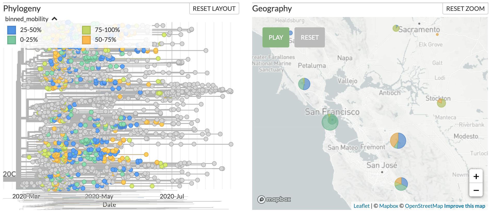

# Annotate mobility data on SARS-CoV-2 phylogenies

This repo provides a minimal, proof-of-concept analysis for how one might annotate phylogenies inferred from SARS-CoV-2 genomes with mobility data to better understand how changes in mobility are related to viral transmission.

[View the precompiled notebook](2020-09-03-annotate-sars-cov-2-phylogeny-with-mobility-data.ipynb), to get a sense of how the analysis works.

## Usage

First, [install miniconda](https://docs.conda.io/en/latest/miniconda.html).
Then, create the associated conda environment and activate it.

```bash
conda env create -f=environment.yaml
conda activate mobility
```

Start a Jupyter lab session and run the entire notebook from scratch.

```bash
jupyter lab 2020-09-03-annotate-sars-cov-2-phylogeny-with-mobility-data.ipynb
```

[Download the precalculated data file](california_mobility.csv) to drag-and-drop onto the corresponding [phylogeny of Californian SARS-CoV-2 genomes](https://nextstrain.org/community/czbiohub/covidtracker/ca).
An example of the resulting annotation is included below.


